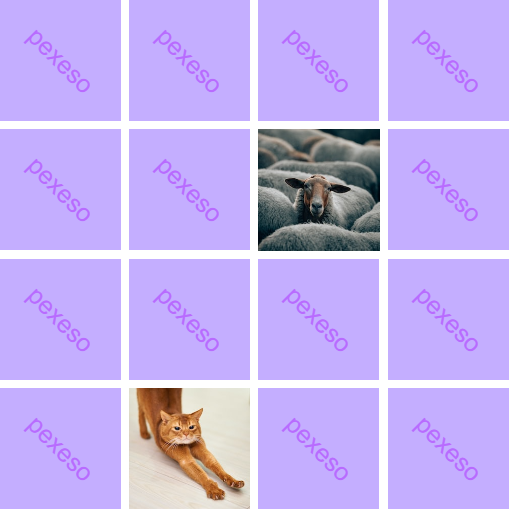

# Úkol 08

## Malé algoritmy

Založte si nový JavaScriptový program a na jeho začátek vložte následující seznam čísel. Budeme jej používat ve všech následujících úlohách.

```js
const numbers = [
  -24, -11, 27, 29, -4, -28, -21, -14, 3, -8, 24, 19, -25, -2, -1, 11, 32, -31, 5
];
```

1. Vypište do stránky všechna čísla.
1. Vypište do stránky druhé mocniny všech čísel.
1. Vypište do stránky pouze záporná čísla.
1. Vypište do stránky absolutní hodnotu všech čísel.
1. Vypište do stránky pouze sudá čísla.
1. Vypište do stránky pouze ta čísla, jejíchž absolutní hodnota je dělitelná třemi.
1. Vypište do stránky jak daleko je každé číslo v seznamu od čísla 5.
1. Vypište do stránky druhé mocnicny vzdáleností všech čísel od čísla 5.
1. Spočítejte, kolik je v seznamu záporných čísel.
1. Spočítejte součet všech čísel v poli.
1. Spočítejte průměr všech čísel v poli.
1. Spočítejte součet všech kladných čísel v poli.

<details>
<summary><b>Řešení</b></summary>

Tady zatím nic není :)

</details>

# Úkol 09

## Pexeso
Oživte pexesové kartičky. Kliknutí na libovolnou kartičku by ji mělo obrátit. Další kliknutí by ji mělo vrátit do původního stavu.



1. Vycházejte ze šablony na GitHubu [cviceni-pexeso](https://github.com/aellopos/cviceni-pexeso).
1. Upravte soubor `app.js` tak, aby pomocí metody `querySelectorAll` prošel všechny prvky se třídou `karticka` a přidal jim posluchač události na kliknutí.
1. Pokud událost nastane odeberte nebo přidejte kartičce třídu `otocena`. Styly už máte nachystané. Kartička s třídou `otocena` uživateli obrázek skrývá. Po odebrání této třídy se obrázek ukáže.

#### Bonusy

1. Pokud jsou dvě kartičky otočené tak, že ukazují obrázek, zařiďte, aby se po jedné sekundě vrátily do původního stavu.

2. Neotáčejte zpět kartičky, u kterých uživatel našel celý pár. Kartičkám přidejte vlastnost `disabled`, aby na ně ani nešlo znovu kliknout.

   - Že jsou kartičky ze stejného páru poznáte tak, že mají uvnitř obrázek `` se stejnou hodnotou v atributu `src`.


<details>
<summary><b>Řešení</b></summary>

Tady zatím nic není :)

</details>
