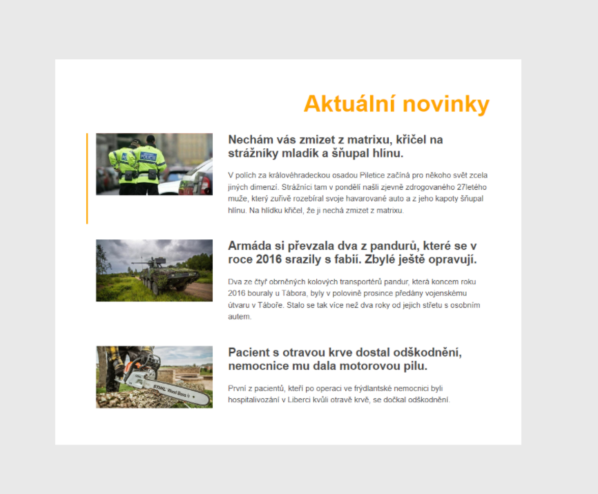
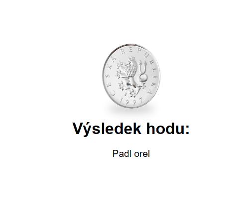
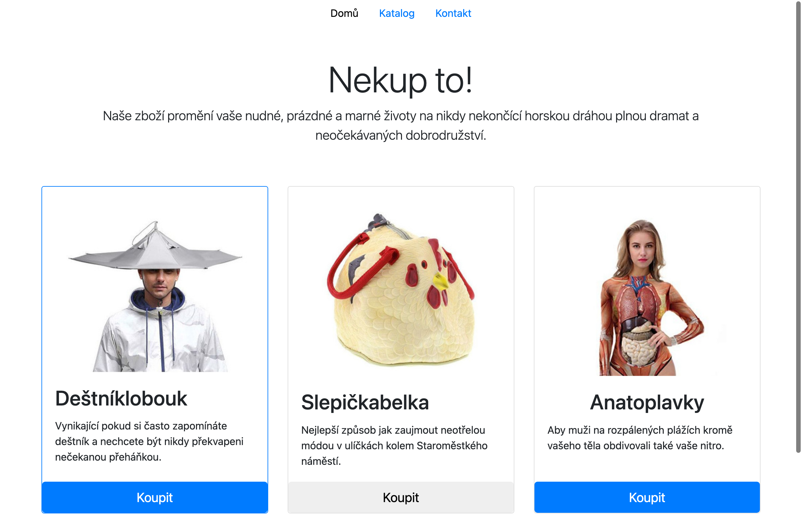

# Cvičení: Manipulace s DOMem
## Novinky

Vytvořte si repozitář ze šablony [cviceni-novinky](https://github.com/aellopos/ukol-novinky). V repozitáři je připravena webová stránka, která zobrazuje několik zajímavých zpráv. Zobrazte stránku v prohlížeči a veškeré úkoly z tohoto cvičení proveďte v JavaScriptovém souboru `index.js`.

1. Pomocí `document.querySelector` vyberte element `body` a uložte si jej do proměnné `bodyElement`. Pomocí této proměnné nastavte barvu pozadí elementu na hodnotu `#e9e9e9`.
1. Do jiné proměnné vyberte element s třídou `news` a nastavte mu barvu pozadí na bílou a maximální šířku na `60rem`.
1. Vyberte element `h1` a nastavte mu (v JavaScriptu) třídu na `news__title`. Nadpis by měl změnit styl. Nastavte také obsah nadpisu na text `Aktuální novinky`.
1. Pomocí atributu `id` vyberte element obsahující první zprávu. Přidejte do jeho atributu `class` třídu `post--main`. První zpráva by tak měla mírně změnit svůj styl.
1. Pomocí CSS selektoru vyberte obrázek ve třetí zprávě (`id` zprávy je `zprava3`) a změňte jeho atribut `src` na obrázek `images/zprava3-novy.jpg`.

Na konci by stránka v prohlížeči měla vypadat jako na obrázku níže:



<details>
<summary><b>Řešení</b></summary>

```js
// a.
const bodyElement = document.querySelector('body');
bodyElement.style.backgroundColor = '#e9e9e9';

// b.
const newsElm = document.querySelector('.news');
newsElm.style.backgroundColor = 'white';
newsElm.style.maxWidth = '60rem';

// c.
const headingElm = document.querySelector('h1');
headingElm.classList.add('news__title');
headingElm.textContent = 'Aktuální novinky';

// d.
const firstPostElm = document.getElementById('zprava1');
firstPostElm.classList.add('post--main');

// e.
const lastPostImgElm = document.querySelector('#zprava3 img');
lastPostImgElm.src = 'images/zprava3-novy.jpg';
```


</details>

## Hod mincí

Vytvořte si repozitář ze šablony [cviceni-hod-minci](https://github.com/aellopos/cviceni-hod-minci). Repozitář obsahuje stránku s nedokončenou simulací hodu mince. Vaším úkolem bude mincí „hodit“.

1. V souboru `index.js` si do proměnné `padlOrel` uložte hodnotu `true` nebo `false` na základě náhodné hodnoty z funkce `Math.random()`. Pravděpodobnost 50:50 zajistíte porovnáním výsledku funkce s hodnotou `0.5`.

   ```js
   const padlOrel = Math.random() < 0.5;
   ```

1. Pomocí `document.querySelector` vyberte ze stránky prvek `.vysledek` a nahraďte jeho obsah textem `Padl orel` nebo `Padla panna` na základě náhodné hodnoty z předchozího kroku.

   ```js
   if (padlOrel) {
     // Nahraďte text pro orla
   } else {
     // Nahraďte text pro pannu
   }
   ```

1. Vyzkoušejte stránku několikrát načíst a koukněte, jestli se text mění.
1. Kromě změny textu ještě přidejte prvku `.mince` druhou třídu `mince--orel` nebo `mince--panna` opět podle hodnoty v proměnné `padlOrel`.
1. Znovu několikrát vyzkoušejte, že obrázek mince odpovídá textu pod ním.




<details>
<summary><b>Řešení</b></summary>

```js
const vysledek = document.querySelector('.vysledek');
const mince = document.querySelector('.mince');

const padlOrel = Math.random() < 0.5;

if (padlOrel) {
  vysledek.textContent = 'Padl orel';
  mince.classList.add('mince--orel');
} else {
  vysledek.textContent = 'Padla panna';
  mince.classList.add('mince--panna');
}
```

</details>

## Kvíz

Vytvořte si repozitář ze šablony [cviceni-kviz](https://github.com/aellopos/cviceni-kviz). V repozitáři je kostra stránky pro kvízové otázky. Napište JavaScriptový program, který vybere element s třídou `question` a nastaví jeho obsah na nějakou kvízovou otázku, například

> Uveďte příjmení amerického vynálezce, který v roce 1876 jako první úspěšně podal patent na zařízení, které je dnes považováno za první telefon.

Použijte funkci `prompt` a zeptejte se uživatele na správnou odpověď. Vyberte element s třídou `answer__text` a nastavte obsah elementu na odpověď od uživatele. Vyberte element s třidou `answer`. Pokud je odpověď příjmení Bell, přidejte k tomuto elementu třídu `answer--correct`. V opačném případě přidejte třídu `answer--wrong`.

<details>
<summary><b>Řešení</b></summary>

```js
const questionElm = document.querySelector('.question');
const question =
  'Uveďte příjmení amerického vynálezce, který v roce 1876 jako první úspěšně podal patent na zařízení, které je dnes považováno za první telefon.';

questionElm.textContent = question;

const userAnswer = prompt(question);

const answerTextElm = document.querySelector('.answer__text');
answerTextElm.textContent = userAnswer;

const answerElm = document.querySelector('.answer');

if (userAnswer === 'Bell') {
  answerElm.classList.add('answer--correct');
} else {
  answerElm.classList.add('answer--wrong');
}
```

</details>

## Nekup to, třídy

Vytvořte si repozitář ze šablony [cviceni-nekupto](https://github.com/aellopos/cviceni-nekupto). Repozitář obsahuje stránku, která nabízí několik neotřelých produktů.

1. Otevřete si naklonovanou složku ve VS Code a prohlédněte si zdrojové HTML. Stránka je nastylována pomocí CSS knihovny [Bootstrapu](https://getbootstrap.com). Co přesně dělají použité CSS třídy není pro toto cvičení podstatné, nemusíte jim věnovat velkou pozornost.
1. V souboru `index.js` si na posledním řádku do proměnné uložte kartu s prvním produktem. Pomocí metody `classList.add` přidejte na tento element třídu `border-primary`, abychom první produkt na stránce zvýraznili.
1. Do jiné proměnné si uložte tlačítko na druhé kartě. Pomocí metody `classList.remove` odeberte třídu `btn-primary` a podívejte se, jak se tlačítko vizuálně změnilo.
1. Do další proměnné si uložte element s třídou `card-title` posledního produktu. Pomocí voláni metody `classList.toggle` přidejte na tento element třídu `text-center`. Text by se měl tímto zarovnat na střed. Vyzkoušejte si, že když tuto metodu zavoláte znova, třída se z prvku odstraní. Takto můžete přepínat mezi přidáním a odebráním třídy pomocí opakovaného volání této metody.

Na konci by stránka v prohlížeči měla vypadat jako na obrázku níže:



<details>
<summary><b>Řešení</b></summary>

```js
const firstCard = document.querySelector('#product1');
firstCard.classList.add('border-primary');

const secondCardButton = document.querySelector('#product2 button');
secondCardButton.classList.remove('btn-primary');

const thirdCardTitle = document.querySelector('#product3 .card-title');
thirdCardTitle.classList.toggle('text-center');
```


</details>

## Nekup to, obsah

Pokračujte v předchozím cvičení. Všimněte si, že v souboru `index.js` jsou uloženy údaje k jednotlivým produktům. Budeme chtít obsah naší stránky vygenerovat z těchto dat místo abychom je měli natvrdo zadrátované v HTML kódu.

1. Otevřete si soubor `index.html` a zkopírujte si HTML obsah prvního produktu a vytvořte z něj řetězec v přiloženém JavaScriptovém souboru. Váš kód může vypadat třeba takto.

   ```js
   const product1HTML = `
     
     <div class="card-body">
       <h2 class="card-title">Deštníklobouk</h2>
       <p class="card-text">Vynikající pokud si často zapomínáte deštník a nechcete být nikdy překvapeni nečekanou přeháňkou.</p>
     </div>
     <button type="button" class="btn btn-lg btn-primary btn-block">Koupit</button>
   `;
   ```

1. Obsah prvního produktu v souboru `index.html` můžeme nyní smazat. Výsledné HTML pak bude vypadat takto.
   ```html
   <div id="product1" class="card mb-4 box-shadow"></div>
   ```
1. Pomocí interpolace řetězců předělejte váš JavaScriptový kód tak, že do vašeho řetězce s produktem vložíte obsah vlastností `image`, `name` a `description`.
1. Do nějaké proměnné si uložte element prvního produktu a nastavte jeho `innerHTML` na váš sestavený řetězec. Tímto na stránku vložíme obrázek prvního produktu.
1. Opakujte tento postup pro všechny ostatní produkty. Na konci byste měli dospět do stavu, kdy soubor `index.html` vůbec neosahuje vnitřek karet pro jednotlivé produkty. Jejich obsah je celý vyroben JavaScriptem z připravených dat.

<details>
<summary><b>Řešení</b></summary>

```js
const product1 = {
  image: 'images/destniklobouk.jpg',
  name: 'Deštníklobouk',
  description:
    'Vynikající pokud si často zapomínáte deštník a nechcete být nikdy překvapeni nečekanou přeháňkou.',
};

const product2 = {
  image: 'images/slepickabelka.jpg',
  name: 'Slepičkabelka',
  description:
    'Nejlepší způsob jak zaujmout neotřelou módou v ulíčkách kolem Staroměstkého náměstí.',
};

const product3 = {
  image: 'images/anatoplavky.jpg',
  name: 'Anatoplavky',
  description:
    'Aby muži na rozpálených plážích kromě vašeho těla obdivovali také vaše nitro.',
};

const product1HTML = `
  
  <div class="card-body">
    <h2 class="card-title">${product1.name}</h2>
    <p class="card-text">${product1.description}</p>
  </div>
  <button type="button" class="btn btn-lg btn-primary btn-block">Koupit</button>
`;
const product1Elm = document.querySelector('#product1');
product1Elm.innerHTML = product1HTML;

const product2HTML = `
  
  <div class="card-body">
    <h2 class="card-title">${product2.name}</h2>
    <p class="card-text">${product2.description}</p>
  </div>
  <button type="button" class="btn btn-lg btn-primary btn-block">Koupit</button>
`;
const product2Elm = document.querySelector('#product2');
product2Elm.innerHTML = product2HTML;

const product3HTML = `
  
  <div class="card-body">
    <h2 class="card-title">${product3.name}</h2>
    <p class="card-text">${product3.description}</p>
  </div>
  <button type="button" class="btn btn-lg btn-primary btn-block">Koupit</button>
`;
const product3Elm = document.querySelector('#product3');
product3Elm.innerHTML = product3HTML;
```

</details>