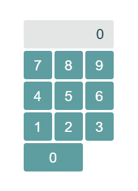
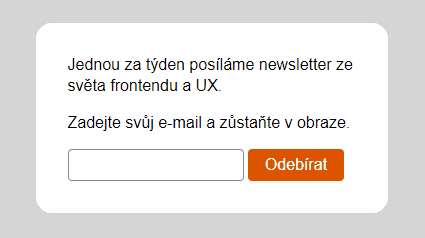
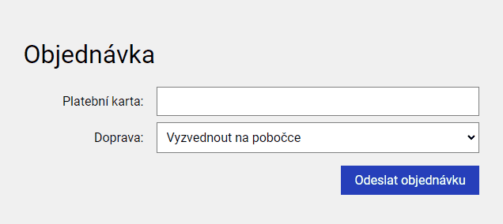

# Cvičení: Základy formulářů
## Kalkulačka
Vytvořte si repozitář ze šablony [cviceni-kalkulacka](https://github.com/aellopos/cviceni-kalkulacka) se stránkou, která obsahuje číselník a displej jednoduché kalkulačky.

Zařiďte, aby se při kliknutí na libovolné tlačítko na displeji kalkulačky objevila cifra, která je na tlačíku napsaná. Postupujte dle návodu:

1. Nejprve vyrobte funkci s názvem `handleDigitClick`. To bude posluchač, který později navěsíme na všechna tlačítka.
1. Váš posluchač bude mít jeden parametr představující událost. Z vlastnosti `target` tohoto parametru získejte tlačíko, na které bylo kliknuto. Cifru zjístíte z jeho `textContent`.
1. Jakmile znáte cifru, vložte ji jako `textContent` na displej kalkulačky.
1. Pověste váš posluchač na všechna tlačítka s ciframi.
1. U běžné kalkulačky mačkáním tlačítek postupně sestavujeme nějaké víceciferné číslo. Zařiďte, aby cifry na displeji přibývaly jako na běžné kalkulačce (tj. nově přidaná cifra se přidá doprava, jako je na animaci výše). Také zaříďte, aby se na displej nedalo vložit delší než devíticiferné číslo.

#### Bonus

- Pomocí podmínky `if` zařiďte, aby číslo na displeji nezačínalo nulou, ledaže je tam nula samotná.

<b>Řešení</b>

Tady zatím nic není

## Newsletter
Podle postupu níže vyrobte stránku podobnou té na obrázku.

1. Vytvořte si novou složku a vytvořte v ní soubory - index.html, style.css a script.js. Soubory propojte.
1. Vložte do ní formulář s textovým políčkem a tlačítkem pro přihlášení k odběru.
1. Vytvořte posluchač pro událost `submit`. Jakmile uživatel zadá svůj e-mail a potvrdí přihlášení, zobrazte na stránce místo formuláře zprávu o úspěšném přihlášení k odběru.

1. Texty můžete vymyslet vlastní nebo využít následující:

   - Jednou za týden posíláme newsletter ze světa frontendu a UX.
   - Zadejte svůj e-mail a zůstaňte v obraze.
   - Odebírat
   - Děkujeme za váš zájem. Těšte se na novinky ze světa frontendu a UX na vaší adrese adresa@domena.cz.

1. Pokud máte čas a chuť, nastylujte stránku dle svého citu. Obrázek výše může posloužit jako inspirace.

<b>Řešení</b>

Tady zatím nic není

# Cvičení: Složitější formuláře

## Objednavka

Podle instrukcí níže vytvořte jednoduchý formulář pro dokončení objednávky na nějakém e-shopu. Formulář umožní uživateli zadat číslo platební karty a způsob dopravy.

1. Vytvořte si novou složku a vytvořte v ní soubory - index.html, style.css a script.js. Soubory propojte.
1. Do souboru `style.css` vložte [styly pro formuláře](https://raw.githubusercontent.com/Czechitas-podklady-WEB/formulare/main/style.css) ať se nemusíte trápit se stylováním.
1. Vytvořte formulář s textovým políčkem pro číslo platební karty. Dejte mu štítek „**Platební karta**“ a atribut `type` nastavte na `text`.
1. Přidejte do formuláře rozbalovací nabídku se štítkem „**Doprava**“. Jako jednotlivé možnosti použijte prvky `option` s následujícím obsahem:

   - vyzvednout na pobočce, atribut `value="pobocka"`,
   - Zásilkovna, atribut `value="zasilkovna"`,
   - Česká pošta, atribut `value="posta"`,
   - PPL, atribut `value="ppl"`.

1. Přidejte tlačítko „**Odeslat objednávku**“.
1. Přidejte posluchače na událost `submit`. Jakmile uživatel formulář odešle, nahraďte celý formulář zprávou „**Objednávka odeslána ke zpracování.**“

#### Bonus 1

- Zkuste si po odeslání formuláře zobrazit všechny hodnoty, které uživatel vyplnil. Vypište je do konzole.
- Pohledem do konzole ověřte, že pokud uživatel zadá jako dopravu **Českou poštu**, v konzoli se objeví hodnota `posta`.

#### Bonus 2

- Platební karta musí mít přesně 16 číslic. Pokud uživatel zadá méně nebo více, zobrazte pod formulářem chybovou hlášku. Pro hlášku si v HTML souboru připravte prvek `
`. Hlášku zobrazte s každým novým vstupem od uživatele (událost `input` na prvku `<input>`). Pokud je vše v pořádku, chybovou hlášku smažte.

  - Pro příliš krátkou kartu použijte text „**Číslo karty je příliš krátké. Chybí X číslic.**“
  - Pro příliš dlouhou kartu použijte text „**Číslo karty je moc dlouhé. Přebývá X číslic.**“

- Zkuste místo události `input` poslouchat na událost `change`. Jak se liší jejich chování? Která varianta je lepší? `input` nebo `change`?
