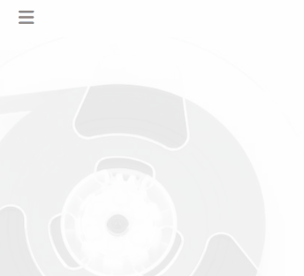
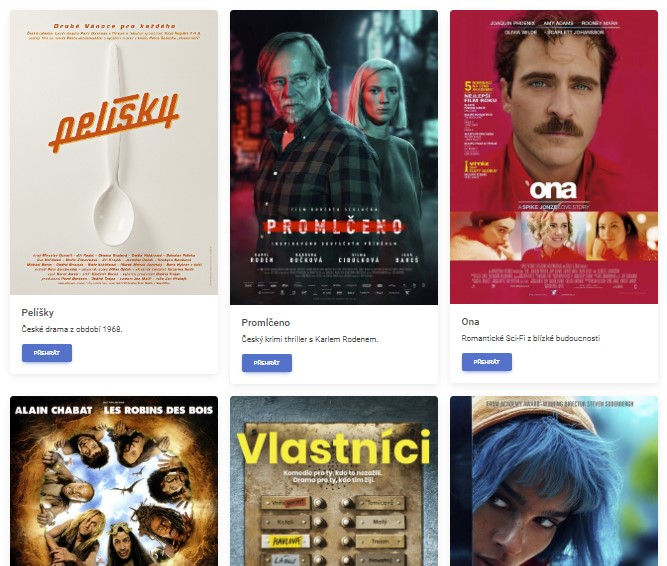
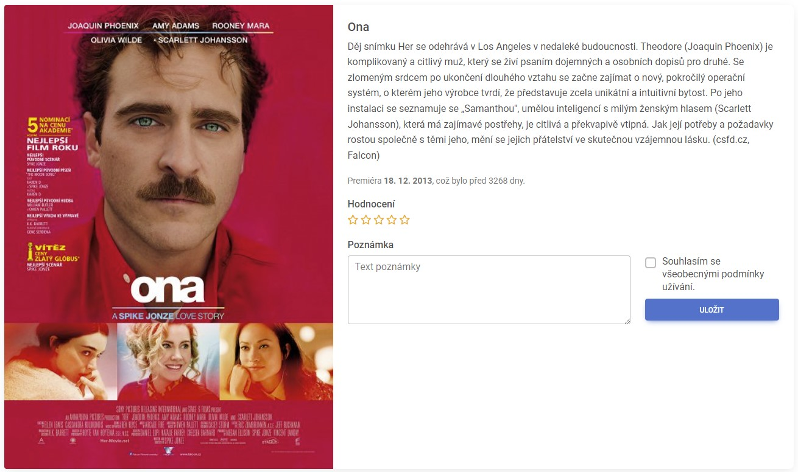
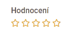
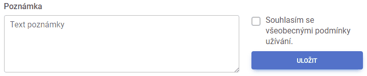
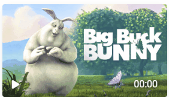

## Úvod

Představte si, že pracujete ve webovém týmu. Kodér vám podle grafického návrhu předchystal stránku fiktivní databáze filmů FilmBox s přehrávačem v HTML a CSS. Vaším úkolem bude web oživit JavaScriptem.

Protože právníci ještě ladí smlouvy s jednotlivými distributory filmů, dostanete zatím jen informace o pár filmech na vyzkoušení a jedno testovací video na vychytání přehrávače.

**Pro uznání projektu je potřeba mít splněné úkoly - 1,2,3,4,5 a 8**

## 1

Nejprve pro naši aplikaci založte projekt z předpřipraveného základu.

1. Vytvořte si repozitář na základě šablony [projekt-FilmBox](https://github.com/aellopos/projekt-FilmBox).
1. Naklonujte si repozitář na svůj počítač do složky, kde máte projekty z kurzu.
1. Složku s repozitářem, kde je mimo jiné soubor `index.html`, otevřete ve VS Code.

## 2

Seznamte se s kódem, který je pro vás v projektu připraven. Postupujte dle následujících kroků.

1. V prohlížeči si prohlédněte jednotlivé stránky. Jsou celkem čtyři.

   - Úvodní stránka
   - Seznam filmů
   - Detail filmu
   - O webu

1. Většinu váší práce budete provádět v JavaScriptových souborech.

   - `spolecne.js` bude obsahovat společný kód pro všechny stránky,
   - `seznam.js` bude obsahovat kód pro stránku se seznamem filmů,
   - a `film.js` bude obsahovat kód pro stránku s detailem filmu.

1. Všimněte si, že v souboru `seznam.js` a `film.js` máte již předchystané pole objektů s filmy.

## 3

Na všech stránkách webu je horní navigace se třemi odkazy. Pro úsporu místa na malých zařízeních se mění na tlačítko s ikonkou hamburgeru. Zařiďte, aby klikání na tlačítko rozbalovalo a opět skrývalo položky menu.

1. V souboru `spolecne.js` najděte pomocí `document.querySelector` prvek s id `menu-tlacitko`.

1. Přidejte mu posluchač události kliknutí.

1. Přidejte prvku s id `menu-polozky` třídu `show` ve chvíli, kdy událost nastane.

1. Rozšiřte kód tak, aby se třída `show` naopak odebrala, pokud ji prvek již měl.

#### Bonus

Změňte ikonku tlačítka na křížek, pokud je menu rozbalené a na hamburger, pokud je sbalené.

- HTML ikonky křížku: `<i class="fas fa-xmark"></i>`
- HTML ikonky hamburgeru: `<i class="fas fa-bars"></i>`



## 4

Na stránce se seznamem filmů vypište karty se všemi filmy z pole `filmy`.

1.  Přejděte v prohlížeči na stránku se seznamem.

1.  Na konci souboru `seznam.js` pomocí `document.querySelector` vyhledejte prvek s id `seznam-filmu`.

1.  Vymažte tomuto prvku jeho vnitřní HTML, aby byl prázdný.

1.  Pomocí cyklu projděte všechny filmy z předpřipraveného pole a pro každý přidejte do prvku `#seznam-filmu` následující HTML doplněné o patřičné informace (název, ochutnávku, plakát).

```html
<div class="col">
   <div class="card">
      
      <div class="card-body">
         <h5 class="card-title">Název filmu</h5>
         <p class="card-text">Krátký popisek filmu.</p>
         <a href="film.html" class="btn btn-primary">Přehrát</a>
      </div>
   </div>
</div>
```



#### Bonus

Přidejte do pole s filmy nějaký další dle vlastního výběru.

## 5

Zobrazte příslušné informace o filmu na stránce s detailem.

1. Protože stránka `film.html` obsluhuje datail všech filmů, budete si muset přes adresu stránky předat informaci, který konkrétní film si uživatel právě prohlíží. Využijeme toho, že dna konec adresy můžeme přidat znak mřížky (`#`) a za něj libovolný text, který následně můžeme v JavaScriptu přečíst. (V tomto kroku jsou jen informace, nic neděláte.)
1. V souboru `seznam.js` v HTML kódu z předchozího úkolu (který zobrazuje jeden film v seznamu) přidejte do odkazu `href` za `film.html` znak mřížky (`#`) a za něj ještě unikátní identifikátor (`id`), který má každý film jiný. HTML by pak mělo vypadat zhruba takto:

   <!-- prettier-ignore -->
   ```js
   `<a href="film.html#${id}" class="btn btn-primary">Přehrát</a>`
   ```

1. V souboru `film.js` zjistěte, na film s jakým `id` se uživatel chce dívat – zjistíte to z property `location.hash`. Všimněte si, že hodnota vlastnosti `hash` začíná znakem mřížky (`#`). Id v poli `filmy` mřížkou nezačínají. Mřížku vhodnou metodou na řetězcích odřízněte. Mřížka není potřeba, je spíš na škodu.

1. Cyklem prohledejte pole `filmy` a film s `id` stejným jako hash (bez mřížky) si poznamenejte do proměnné. (Případně můžete také použít funkci [find](https://developer.mozilla.org/en-US/docs/Web/JavaScript/Reference/Global_Objects/Array/find) na poli.)

1. Vepište informace (název, popis, plakát) o nalezeném filmu do stránky. Upravte textový obsah a atributy příslušných potomků prvku `#detail-filmu`. Do `.card-text` vepište dlouhý popis filmu.



## 6

Zobrazte datum premiéry filmu.

1. Zapojte do stránky `film.html` knihovnu dayjs přidáním HTML do hlavičky.

   ```html
   <script src="https://cdn.jsdelivr.net/npm/dayjs@1/dayjs.min.js"></script>
   ```

1. Do prvku s id `premiera` vepište HTML `Premiéra <strong>29. 11. 2022</strong>`, kde datum nahraďte datumem premiéry filmu naformátovaným pomocí `dayjs` a metody `.format()`.

   1. Datum v dayjs vytvoříte například voláním `dayjs('2022-12-24')`. Vánoce nahraďte datumem premiéry filmu.

   1. Hezké datum z dayjs vytvoříte voláním `dayjs('2022-12-24').format('D. M. YYYY')`.

#### Bonus

Spočítejte kolik dní uběhlo od premiéry nebo za kolik dní premiéra bude. Pomůže vám metoda `.diff()`.

1.  Dnešní datum pro další výpočty v dayjs vytvoříte voláním `dayjs()`.

1.  Datum premiéry pak voláním `dayjs('2022-12-24')`.

1.  Pro vzdálenost mezi datumy pužijte metodu `.diff()` například takto: `dayjs("2022-12-24").diff(dayjs(), 'days')`.

1.  Do elementu s id `premiera` připište, před kolika dny nebo za kolik dní bude nebo jestli je dnes.

#### Extra bonus

Zařiďte, aby tvar slova _den_ byl ve správném tvaru, aby se třeba nestalo „což bylo před 1 dní“.

## 7

Zařiďte, aby klikání na hvězdičky v hodnocení filmu zvýraznilo všechny hvězdičky až po kliknutou.

1.  V souboru `film.js` si přichystejte pomocnou funkci pro zvýraznění určitého počtu hvězdiček.

    1.  Ve funkci počítejte s jedním vstupním parametrem, číslem od jedné do pěti.

    1.  Ve funkci projděte cyklem všechny prvky se třídou `fa-star`.

    1.  Zvýrazněným hvězdičkám odeberte třídu `far` a přidejte `fas`. Ostatním obráceně. Zvýrazněné nechť jsou ty, které jsou v pořadí menší nebo rovny číslu ze vstupu funkce. Pokud tedy funkci zavoláte například s číslem tři, první tři hvězdičky budou mít třídu `fas` a zbylé dvě budou mít `far`.

    1.  Funkci vyzkoušejte zavolat s různými hodnotami. Zkušební volání ale v kódu nenechávejte.

1.  Smyčkou přidejte všem hvězdičkám, prvkům se třídou `fa-star` posluchač události na kliknutí.

1.  Po kliknutí zjistěte, na kterou hvězdičku uživatel kliknul. Každá hvězdička má ve svém textovém obsahu číslo pořadí.

1.  Číslo využijte jako parametr funkce předchystané podle instrukcí výše.

#### Bonus

Při přejíždění myší přes hvězdičky zvýrazněte všechny až po tu, na které je uživatel myší.

1. Kromě posluchače události na kliknutí přidejte i posluchač na `mouseenter` a opět podle textového obsahu hvězdičky zavolejte vaši funkci s příslušným parametrem.

1. Pokud uživatel s myší odjede pryč, zvýrazněte hvězdičky zpět tak, jak byly po posledním kliknutí.

   1. Kdykoliv uživatel na nějakou hvězdičku klikne, poznamenejte si bokem, kolikátá to byla.

   1. S událostí `mouseleave` zavolete vaši funkci s poznamenanou hodnotou.




## 8

Umožněte uživateli vyplněním formuláře přidat k filmu vlastní poznámku.

1. V souboru `film.js` pomocí `document.querySelector` najděte prvek s id `note-form`.

1. Při pokusu o odeslání tohoto formuláře zamezte výchozí chování prohlížeče.

1. Ověřte, že uživatel do textového pole, prvku s id `message-input` něco napsal. Pokud ne, přidejte prvku třídu `is-invalid`, která ho zvýrazní červeně.

1. Pokud uživatel něco napsal, ověřte, že souhlasil s podmínkami, že zaškrtl políčko s id `terms-checkbox`. Pokud nezaškrtl, přidejte políčku třídu `is-invalid`

1. Pokud uživatel splnil obě podmínky z kroků výše, nahraďte HTML obsah formuláře za odstavec `<p class="card-text">…</p>` s textem z textového pole.

#### Bonus

Pokud vyživatel něco ve formuláři vynechal, pomozte mu zaměřením příslušného formulářového prvku.

1. V místech, kde přidáváte třídu `is-invalid`, volejte také na formulářovém prvku metodu `.focus()`. Ta například u textového pole přenese kurzor pro psaní rovnou na správné místo, aby uživatel mohl začít psát z klávesnice.



## 9

Obohaťte video přehrávač vlastními ovládacími prvky.

1. V souboru `film.html` u prvku `<video>` umažte ručně atribut `controls`. Skryjí se tím ovládací prvky předchystané přímo prohlížečem. V CSS je pak už hotový kód, který automaticky zobrazí `<div class="player-controls">` s vlastním vizuálem. Vy v CSS nemusíte nic měnit. Jen si všimněte, že se na stránce objevily jiné ovládací prvky, které ale nereagují na klikání.

1. Oživte tlačítko pro přehrávání a pozastavení.

   1. V souboru `film.js`, pokud je na stránce prvek s id `prehravac`, přidejte posluchač události kliknutí na prvek se třídou `play`.

   1. Na kliknutí zavolejte na prvku `<video>` metodu `.play()`. Pokud uživatel klikne, video by se mělo začít přehrávat.

   1. Přidejte na `<video>` posluchač události `playing`. Ta nastává v okamžiku, kdy se video začíná přehrávat.

   1. Při události na prvku s id `prehravac` přidejte třídu `playing`. Předchystané CSS v takovém případě zařídí, že se přehrávací tlačítko skryje a místo něho se objeví tlačítko pro pozastavení.

   1. Tlačítku `.pause` přidejte posluchač, který po kliknutí zavolá na videu metodu `.pause()`, což pozastaví přehrávání.

   1. Poslouchejte na událost s názvem `pause`. Pokud nastane, odeberte z přehrávače třídu `playing`.

1. V prvku se třídou `current-time` zobrazujte aktuální čas přehrávaného videa.

   1. Poslouchejte na prvku videa událost `timeupdate`. Pokud nastane, vyčtěte z videa přes vlastnost `.currentTime` počet přehraných sekund.

   1. Aktuální čas zaokrouhlete a převeďte zvlášť na minuty a sekundy.

   1. Obě hodnoty oddělené dvojtečkou vypište do prvku `.current-time`.

#### Bonus

1. Spusťte/pozastavte přehrávání, pokud uživatel na stránce zmáčkne klávesu mezerník.

1. Všimněte si, že video se pozastavuje a přehrává, když uživatel píše do formuláře pro poznámku text a dělá u toho mezery. Spusťte/pozastavte přehrávání pouze v případě, že uživatel nebyl ve formuláři, když mačkal mezerník.

   ```js
   if (
     event.code === 'Space' &&
     event.target.tagName !== 'TEXTAREA' &&
     event.target.tagName !== 'INPUT' &&
     event.target.tagName !== 'BUTTON'
   ) {
     // …
   }
   ```

#### Extra bonus

Skryjte ovládací panel, pokud uživatel po dobu **tří sekund** nepohnul myší ani nestiskl žádnou klávesu. **Využijte časovač**. S každým pohnutím nebo stiskem ho zrušte a nastavte znovu na tři sekundy. Po uplynutí přidejte prvku `.player-controls` třídu `hidden`. Pro opětovné zobrazení (s každým pohybem, stiskem) třídu `hidden` zase odeberte, aby se ovládání zpět objevilo.

